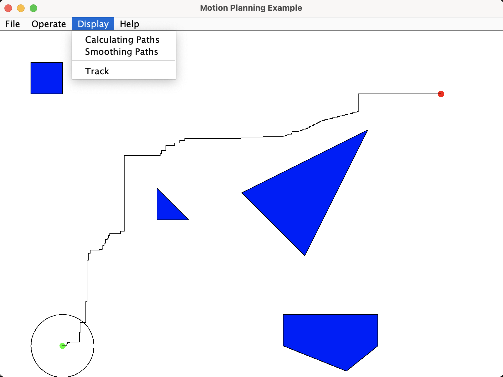

# Motion Planning for A*

**目的：** 本次程式的創作，主要來自學習Motion Planning時，教授要求完成的一項專案作業。希望在一個指定大小範圍內，具有數個多邊形狀的障礙物。每個障礙物在進行路徑規劃前，使用者可以透過滑鼠拖曳，擺到任意位置。計算完畢後，除了演算法計算出的路徑外，也能透過平滑化技術，修整路徑。

**開發語言：** Java

**開發環境：** Visual Studio Code

**程式解說：** 撇除Java GUI的人機互動程式碼外，以下是開發該程式所採用的概念步驟，以下將依序進行說明。
1. 基本物件資訊的設置，含起點、終點、移動物體與障礙物座標的輸入。
2. 將空間進行轉換，把移動物體(本專案中的移動物體形狀為圓形，半徑為50px)，轉化為點狀物(指為1X1px)；而障礙物的尺寸，則將加厚50px。
3. 使用A*進行路線規劃，過程中會使用到點與多邊形的碰撞檢測。
4. 為了刪除冗餘的路徑，將計算出來的結果，進行平滑化處理。

**檔案說明：**
```bash
.
├── LICENSE
├── README.md
├── 執行畫面.png  # 軟體執行畫面
└── app  # 開發程式資料夾
     ├── MotionPlanningExample.java  # 主程式
     ├── MenuBar.java  # 設置MenuBar模組
     ├── PolygonPanel.java  # 繪製圖形模組
     ├── AStar.java  # A＊演算法模組
     ├── CheckCollisions.java  # 檢驗碰撞模組
     └── SmoothPath.java  # 平滑化路徑模組
```

**操作方式：** 該程式設計採用Java GUI，除了Form內的障礙物，可以利用滑鼠拖拉方式改變擺放位置外，對於MenuBar的操作將由下列行說明：
1. File -> Initial: 初始化障礙物位置。
2. File -> Close: 關閉視窗。
3. Operate -> Run: 執行A*演算法。
4. Display -> Calculating Paths: 在Form繪畫A*規劃的原始路線。
5. Display -> Smoothing Paths: 在Form繪畫平滑化的路線。
6. Display -> Track: 移動物體移動的情況。
7. Help -> About: 程式說明。

**參考資料：** 
為了A*演算演算法執行效率，參考以下網路資源進行修改。文章名稱：[Master Computer Science and Engineering Part I-a: Curriculum Outline (Java Perspective)](https://medium.com/@yugalnandurkar5/master-computer-science-and-engineering-part-i-a-curriculum-outline-java-perspective-5f151ef7b9fb)

**運行結果：** 
<br>
<div align="center">
	
</div>
<br>
